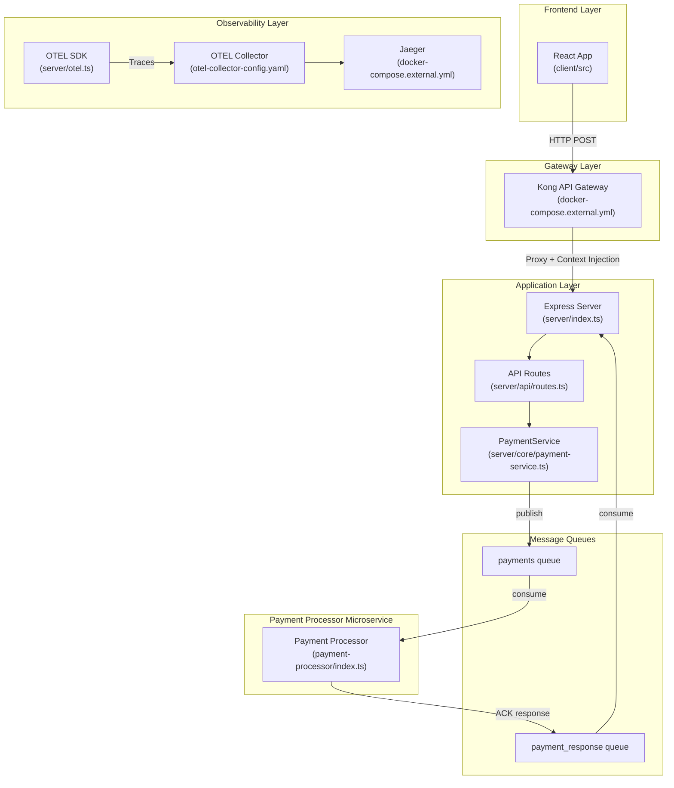

# OtelE2E Architecture & Repository Map

## System Overview

This repository demonstrates OpenTelemetry context propagation using a payment processing system with Kong API Gateway and RabbitMQ messaging.

## Architecture Diagram



## Repository Structure

```
OtelE2E/
├── client/                     # Frontend React Application
│   └── src/
│       ├── App.tsx            # Main app component
│       ├── pages/             # Page components (PaymentDemo)
│       ├── components/        # UI components (shadcn/ui)
│       ├── hooks/             # React hooks
│       └── lib/               # Utilities (queryClient, utils)
│
├── server/                     # Backend Express Application
│   ├── index.ts               # App entrypoint, middleware setup
│   ├── otel.ts                # OpenTelemetry SDK configuration
│   ├── storage.ts             # In-memory data storage
│   ├── vite.ts                # Vite dev server integration
│   ├── api/
│   │   └── routes.ts          # REST API endpoints
│   ├── core/
│   │   └── payment-service.ts # Payment business logic
│   └── services/
│       ├── kong-client.ts     # Kong Gateway client
│       └── rabbitmq-client.ts # RabbitMQ producer/consumer
│
├── shared/
│   └── schema.ts              # Zod schemas (Payment, Trace, Span)
│
├── scripts/
│   ├── start-dev.js           # Development startup script
│   ├── e2e-test.js            # Automated E2E tests
│   ├── enable-kong-otel.js    # Kong OTEL plugin config
│   └── enable-kong-cors.js    # Kong CORS plugin config
│
├── .github/
│   └── workflows/
│       └── e2e-tests.yml      # GitHub Actions CI pipeline
│
├── docker-compose.external.yml # Docker services (Kong, RabbitMQ, Jaeger, etc.)
├── otel-collector-config.yaml  # OTEL Collector pipeline config
├── tempo-config.yaml           # Grafana Tempo config
└── package.json                # Node dependencies and scripts
```

## Key Objects & Their Responsibilities

### Domain Objects (shared/schema.ts)

| Object | Purpose |
|--------|---------|
| `Payment` | Payment transaction record with amount, currency, recipient |
| `Trace` | Distributed trace metadata (traceId, rootSpanId, status) |
| `Span` | Individual span within a trace (operationName, serviceName, duration) |
| `User` | User authentication data (not currently used) |

### Server Components

| Component | File | Responsibility |
|-----------|------|----------------|
| `Express App` | `server/index.ts` | HTTP server, middleware, lifecycle |
| `OTEL SDK` | `server/otel.ts` | Trace collection, span processing, batch export |
| `API Routes` | `server/api/routes.ts` | REST endpoints: POST /payments, GET /traces |
| `PaymentService` | `server/core/payment-service.ts` | Payment validation, storage, queue publishing |
| `KongClient` | `server/services/kong-client.ts` | Kong service/route configuration |
| `RabbitMQClient` | `server/services/rabbitmq-client.ts` | Message publishing with W3C trace context |
| `MemoryStorage` | `server/storage.ts` | In-memory data store for payments, traces |

### Infrastructure Components

| Component | Config File | Purpose |
|-----------|-------------|---------|
| Kong Gateway | `docker-compose.external.yml` | API gateway, context injection |
| RabbitMQ | `docker-compose.external.yml` | Message queue |
| OTEL Collector | `otel-collector-config.yaml` | Trace aggregation, routing |
| Jaeger | `docker-compose.external.yml` | Trace visualization |
| Tempo | `tempo-config.yaml` | Trace storage backend |

## Data Flow

### Payment Request Flow
```
1. UI submits payment form
2. Request goes to Kong Gateway (port 8000)
3. Kong injects/preserves trace context (traceparent header)
4. Kong proxies to Express server (port 5000)
5. Express processes with OTEL auto-instrumentation
6. PaymentService creates payment record
7. RabbitMQClient publishes message with trace context
8. Consumer receives and processes message
9. All spans exported to OTEL Collector → Jaeger
```

### Trace Context Propagation
```
Mode 1 (Empty Headers): UI → Kong (creates traceparent) → API → RabbitMQ
Mode 2 (Client Headers): UI (creates traceparent) → Kong (preserves) → API → RabbitMQ
```

## NPM Scripts

| Script | Purpose |
|--------|---------|
| `npm run dev` | Start all services (Docker + Express + Vite) |
| `npm run dev:server` | Start Express server only |
| `npm run test:e2e` | Run automated E2E tests |
| `npm run build` | Build for production |

## Key Configurations

| File | Purpose |
|------|---------|
| `package.json` | Dependencies, scripts |
| `tsconfig.json` | TypeScript config |
| `vite.config.ts` | Vite bundler config |
| `tailwind.config.ts` | Tailwind CSS config |
| `docker-compose.external.yml` | Docker services |
