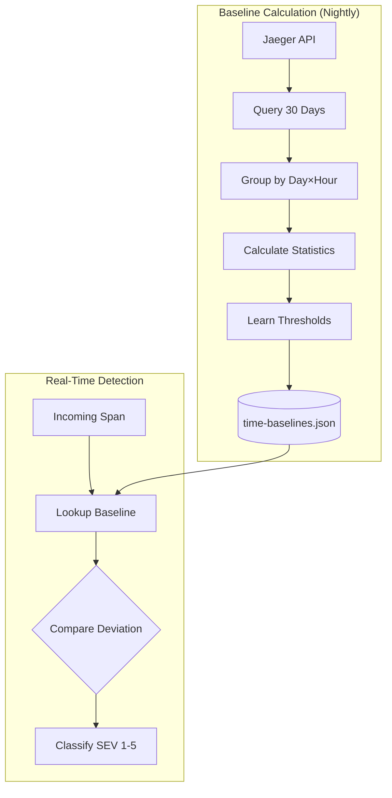
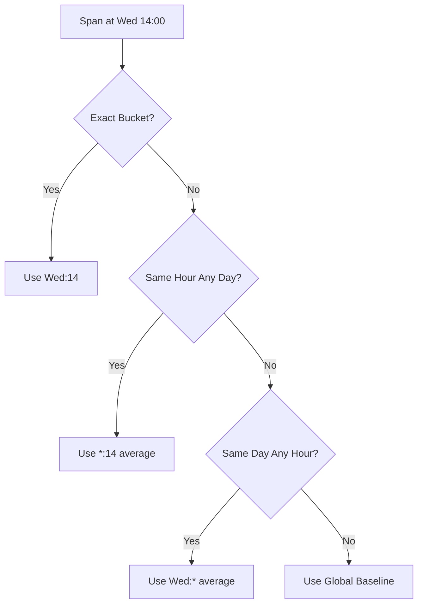

# Anomaly Detection: Time-Aware Adaptive Thresholds

Technical design document for the intelligent trace monitoring system.

## Problem Statement

Fixed threshold anomaly detection (e.g., 3σ = warning, 5σ = critical) fails because:
- **Time variance**: A 200ms API call at 2am may be normal, but anomalous at 2pm
- **Static percentiles**: Fixed multipliers don't reflect actual deviation distributions
- **Alert fatigue**: Too many false positives at low-traffic periods

---

## Solution: Time-Aware Baselines with Adaptive Thresholds




> Note: SVG is available at `docs/images/baseline-calculation.svg` if you prefer vector images.

---

## 1. Time Bucketing Strategy

### 168 Unique Buckets (7 days × 24 hours)

Each span is assigned to a bucket based on when it occurred:

```typescript
// Bucket key generation
const dayOfWeek = timestamp.getDay();    // 0-6 (Sun-Sat)
const hourOfDay = timestamp.getHours();  // 0-23
const bucketKey = `${spanKey}:${dayOfWeek}:${hourOfDay}`;
```

### Why Time Buckets?
- **Monday 9am** traffic patterns differ from **Saturday 3am**
- Baselines are specific to each time slot
- Reduces false positives during low-traffic periods

---

## 2. Baseline Calculation

### Data Source: [baseline-calculator.ts](file:///c:/Users/bizai/Documents/GitHub/OtelE2E/server/monitor/baseline-calculator.ts)

```typescript
// Query 30 days of historical data
const lookbackDays = 30;
const endTime = Date.now();
const startTime = endTime - (lookbackDays * 24 * 60 * 60 * 1000);

// Fetch from Jaeger
const traces = await fetch(
  `${JAEGER_URL}/api/traces?service=${service}&start=${startTime}&end=${endTime}&limit=5000`
);
```

### Statistics Per Bucket

For each time bucket, we compute:

| Statistic | Formula | Purpose |
|-----------|---------|---------|
| **Mean (μ)** | `Σx / n` | Expected duration |
| **Std Dev (σ)** | `√(Σ(x-μ)² / n)` | Variability |
| **Sample Count** | `n` | Confidence metric |

```typescript
interface TimeBaseline {
  spanKey: string;        // "service:operation"
  dayOfWeek: number;      // 0-6
  hourOfDay: number;      // 0-23
  mean: number;           // Average duration (ms)
  stdDev: number;         // Standard deviation
  sampleCount: number;    // Data points
  thresholds: AdaptiveThresholds;
}
```

---

## 3. Adaptive Threshold Learning

### From Fixed to Learned Thresholds

**Old Approach (Fixed):**
```typescript
const WARNING = 3.0;   // Always 3σ
const CRITICAL = 5.0;  // Always 5σ
```

**New Approach (Learned from Data):**
```typescript
// Sort historical deviations and find percentiles
const deviations = historicalData.map(d => (d - mean) / stdDev);
deviations.sort((a, b) => a - b);

const thresholds = {
  sev5: percentile(deviations, 80),   // ~1.3σ
  sev4: percentile(deviations, 90),   // ~1.6σ
  sev3: percentile(deviations, 95),   // ~2.0σ
  sev2: percentile(deviations, 99),   // ~2.6σ
  sev1: percentile(deviations, 99.9), // ~3.3σ
};
```

### Why Adaptive?
- Thresholds reflect **actual** deviation distributions
- Different services can have different natural variability
- Seasonal adjustments happen automatically

---

## 4. Severity Classification (SEV 1-5)

### Types: [types.ts](file:///c:/Users/bizai/Documents/GitHub/OtelE2E/server/monitor/types.ts)

```typescript
export type SeverityLevel = 1 | 2 | 3 | 4 | 5;

export const SEVERITY_CONFIG = {
  1: { name: 'Critical', percentile: 99.9, color: '#dc2626' },
  2: { name: 'Major',    percentile: 99,   color: '#ea580c' },
  3: { name: 'Moderate', percentile: 95,   color: '#d97706' },
  4: { name: 'Minor',    percentile: 90,   color: '#ca8a04' },
  5: { name: 'Low',      percentile: 80,   color: '#65a30d' },
};
```

### Classification Logic

```typescript
private getSeverity(deviation: number, thresholds: AdaptiveThresholds) {
  if (deviation >= thresholds.sev1) return { level: 1, name: 'Critical' };
  if (deviation >= thresholds.sev2) return { level: 2, name: 'Major' };
  if (deviation >= thresholds.sev3) return { level: 3, name: 'Moderate' };
  if (deviation >= thresholds.sev4) return { level: 4, name: 'Minor' };
  if (deviation >= thresholds.sev5) return { level: 5, name: 'Low' };
  return null; // Not anomalous
}
```

---

## 5. Baseline Lookup with Fallback

When checking a span, we look for the most specific baseline:



### Implementation

```typescript
getBaseline(spanKey: string, dayOfWeek: number, hourOfDay: number) {
  // 1. Try exact bucket
  const exact = this.baselines.get(`${spanKey}:${dayOfWeek}:${hourOfDay}`);
  if (exact && exact.sampleCount >= MIN_SAMPLES) return exact;
  
  // 2. Fallback to hourly average across all days
  const hourly = this.getHourlyAverage(spanKey, hourOfDay);
  if (hourly) return hourly;
  
  // 3. Fallback to daily average
  const daily = this.getDailyAverage(spanKey, dayOfWeek);
  if (daily) return daily;
  
  // 4. Global fallback
  return this.getGlobalBaseline(spanKey);
}
```

---

## 6. API Endpoints

| Endpoint | Method | Purpose |
|----------|--------|---------|
| `/api/monitor/recalculate` | POST | Trigger baseline recalculation |
| `/api/monitor/time-baselines` | GET | View all computed baselines |
| `/api/monitor/anomalies` | GET | Get active anomalies with SEV levels |

### Manual Trigger

```bash
curl -X POST http://localhost:5000/api/monitor/recalculate
```

Response:
```json
{
  "success": true,
  "baselinesCount": 168,
  "duration": 4523,
  "message": "Calculated 168 time-aware baselines from 45,000 spans"
}
```

---

## 7. Storage

### Time Baselines: `data/time-baselines.json`

```json
[
  {
    "spanKey": "exchange-api:GET",
    "dayOfWeek": 1,
    "hourOfDay": 14,
    "mean": 45.2,
    "stdDev": 12.3,
    "sampleCount": 1250,
    "thresholds": {
      "sev5": 1.28,
      "sev4": 1.65,
      "sev3": 1.96,
      "sev2": 2.58,
      "sev1": 3.29
    }
  }
]
```

---

## 8. Default Thresholds (Bootstrap)

When no historical data exists, we use statistical defaults:

```typescript
const DEFAULT_THRESHOLDS = {
  sev5: 1.3,   // ~80th percentile of normal distribution
  sev4: 1.65,  // ~90th percentile
  sev3: 2.0,   // ~95th percentile
  sev2: 2.6,   // ~99th percentile
  sev1: 3.3,   // ~99.9th percentile
};
```

These are replaced with learned thresholds after the first recalculation.

---

## Summary

| Component | File | Purpose |
|-----------|------|---------|
| Types | `types.ts` | `TimeBaseline`, `SeverityLevel`, `AdaptiveThresholds` |
| Calculator | `baseline-calculator.ts` | 30-day query, bucketing, percentile learning |
| Detector | `anomaly-detector.ts` | Real-time classification with SEV 1-5 |
| Storage | `history-store.ts` | Persistence of baselines |
| API | `routes.ts` | Recalculation trigger, baseline query |
