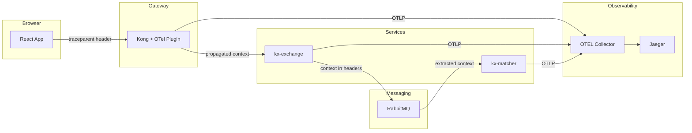
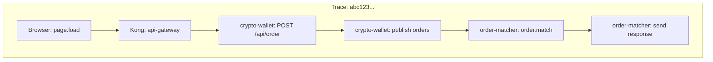

# OpenTelemetry Tracing Implementation Guide

A practical guide to distributed tracing in KrystalineX with **detailed context propagation** for span hierarchy.

> **⚠️ IMPORTANT**: Read the Service Naming Convention section when renaming services to avoid breaking trace correlation in Jaeger.

## Service Naming Convention

KrystalineX uses a consistent `kx-*` naming convention for all services:

| Service | OTEL Service Name | Tracer Name | Description |
|---------|-------------------|-------------|-------------|
| Web Client | `kx-wallet` | `kx-wallet` | Browser-based React frontend |
| API Gateway | `api-gateway` | (Kong plugin) | Kong gateway for routing |
| Exchange Server | `kx-exchange` | `kx-exchange` | Main Express.js API server |
| Order Matcher | `kx-matcher` | `kx-matcher` | RabbitMQ consumer for order execution |

### Tracer Instances
When creating tracers, **always use the same name as the service**:

```typescript
// ✅ Correct - matches service name
const tracer = trace.getTracer('kx-exchange');

// ❌ Wrong - different from service name
const tracer = trace.getTracer('rabbitmq-client');
```

---

## Architecture Overview




> Note: SVG is available at `docs/images/trace-hierarchy.svg` if you prefer vector images.
---

## Critical: How Spans Join Into Hierarchy

Spans form a parent-child hierarchy when:
1. **The same Trace ID** is used across all spans
2. **Parent Span ID** is passed to child spans via context

> [!IMPORTANT]
> Without proper context propagation, you get **orphaned spans** - each service creates its own trace instead of joining the parent trace.

---

## 1. Client-Side: Initiating Trace Context

### W3C Traceparent Format

```
traceparent: 00-{traceId}-{spanId}-{flags}
             │   │         │        └── 01 = sampled
             │   │         └── 16-char hex span ID
             │   └── 32-char hex trace ID
             └── version
```

### Implementation: [client/src/lib/tracing.ts](file:///c:/Users/bizai/Documents/GitHub/OtelE2E/client/src/lib/tracing.ts)

```typescript
import { v4 as uuidv4 } from 'uuid';

export function generateTraceId(): string {
  return uuidv4().replace(/-/g, '');  // 32 hex chars
}

export function generateSpanId(): string {
  return uuidv4().replace(/-/g, '').substring(0, 16);  // 16 hex chars
}

export function createTraceHeaders(traceId?: string, spanId?: string) {
  const currentTraceId = traceId || generateTraceId();
  const currentSpanId = spanId || generateSpanId();
  
  return {
    'traceparent': `00-${currentTraceId}-${currentSpanId}-01`,
    'tracestate': `payment-demo=1`,
  };
}
```

This is used when making API calls from the browser to establish the **root span**.

---

## 2. Kong Gateway: W3C Context Propagation

Kong receives the `traceparent` header and propagates it downstream.

### Plugin Configuration: [scripts/enable-kong-otel.js](file:///c:/Users/bizai/Documents/GitHub/OtelE2E/scripts/enable-kong-otel.js)

```javascript
const pluginConfig = {
  name: 'opentelemetry',
  config: {
    endpoint: 'http://otel-collector:4318/v1/traces',
    resource_attributes: {
      'service.name': 'api-gateway'
    },
    header_type: 'w3c',  // CRITICAL: Use W3C Trace Context format
  }
};
```

> [!TIP]
> `header_type: 'w3c'` ensures Kong uses the standard `traceparent` header format that Node.js SDK understands.

### What Kong Does:
1. Receives `traceparent` from client (or creates one)
2. Creates its own span as **child** of client span
3. Forwards `traceparent` to upstream services with Kong's span as new parent

---

## 3. Node.js SDK: Automatic HTTP Propagation

### Instrumentation Setup: [server/instrumentation.ts](file:///c:/Users/bizai/Documents/GitHub/OtelE2E/server/instrumentation.ts)

```typescript
import { NodeSDK } from '@opentelemetry/sdk-node';
import { OTLPTraceExporter } from '@opentelemetry/exporter-trace-otlp-grpc';
import { getNodeAutoInstrumentations } from '@opentelemetry/auto-instrumentations-node';
import { Resource } from '@opentelemetry/resources';
import { ATTR_SERVICE_NAME } from '@opentelemetry/semantic-conventions';

const sdk = new NodeSDK({
  resource: new Resource({
    [ATTR_SERVICE_NAME]: 'crypto-wallet',
  }),
  traceExporter: new OTLPTraceExporter({
    url: 'http://localhost:4317',
  }),
  instrumentations: [getNodeAutoInstrumentations()],
});

sdk.start();
```

### How Auto-Instrumentation Works:

When an HTTP request arrives with `traceparent`:
1. **`http` instrumentation** extracts the context
2. Creates an **Express span** as child of the incoming context
3. Sets this span as the **active context**
4. All spans created during request handling inherit this parent

> [!IMPORTANT]
> Auto-instrumentation only handles HTTP. For **RabbitMQ**, you must propagate manually.

---

## 4. RabbitMQ Producer: Manual Context Injection

### Implementation: [server/services/rabbitmq-client.ts](file:///c:/Users/bizai/Documents/GitHub/OtelE2E/server/services/rabbitmq-client.ts)

```typescript
import { trace, context, SpanKind, propagation } from '@opentelemetry/api';

async publishOrder(order: Order): Promise<Response> {
  // 1. Get the CURRENT active context (from HTTP request span)
  const parentContext = context.active();
  
  // 2. Create producer span as CHILD of the HTTP span
  const span = this.tracer.startSpan('publish orders', {
    kind: SpanKind.PRODUCER,
    attributes: {
      'messaging.system': 'rabbitmq',
      'messaging.destination': this.ORDERS_QUEUE,
      'order.id': order.orderId,
    }
  }, parentContext);  // <-- CRITICAL: Pass parentContext here!
  
  // 3. Create context with our new span
  const spanContext = trace.setSpan(parentContext, span);
  
  // 4. Run the publish operation within this context
  context.with(spanContext, () => {
    // 5. Inject trace context into message headers
    const headers: Record<string, string> = {};
    propagation.inject(spanContext, headers);
    
    // 6. Also preserve the original HTTP span for response routing
    const parentHeaders: Record<string, string> = {};
    propagation.inject(parentContext, parentHeaders);
    
    // 7. Send message with BOTH contexts
    this.channel.sendToQueue(this.ORDERS_QUEUE, Buffer.from(message), {
      headers: {
        ...headers,                                    // For consumer span
        'x-parent-traceparent': parentHeaders.traceparent,  // For response
        'x-parent-tracestate': parentHeaders.tracestate,
      }
    });
  });
  
  span.end();
}
```

### Key Points:
| Step | Purpose |
|------|---------|
| `context.active()` | Gets the HTTP request span context |
| `startSpan(..., parentContext)` | Creates span as child |
| `trace.setSpan()` | Attaches span to context |
| `propagation.inject()` | Serializes context to headers |
| `x-parent-traceparent` | Preserves original for response correlation |

---

## 5. RabbitMQ Consumer: Context Extraction

### Implementation: [payment-processor/index.ts](file:///c:/Users/bizai/Documents/GitHub/OtelE2E/payment-processor/index.ts)

```typescript
import { trace, context, SpanKind, propagation } from '@opentelemetry/api';

channel.consume(ORDERS_QUEUE, async (msg) => {
  // 1. Extract headers from message
  const headers = msg.properties.headers || {};
  
  // 2. EXTRACT parent context from message headers
  const parentContext = propagation.extract(context.active(), headers);
  
  // 3. Also get the original POST span (for response routing)
  const originalPostTraceparent = headers['x-parent-traceparent'];
  
  // 4. Create consumer span as CHILD of extracted context
  const span = tracer.startSpan('order.match', {
    kind: SpanKind.CONSUMER,
    attributes: {
      'messaging.system': 'rabbitmq',
      'messaging.source': ORDERS_QUEUE,
    }
  }, parentContext);  // <-- CRITICAL: Links to producer span!
  
  // 5. Process within the extracted context
  await context.with(trace.setSpan(parentContext, span), async () => {
    // Processing logic...
    const result = await processOrder(msg);
    
    // 6. Send response with ORIGINAL context for correlation
    channel.sendToQueue(RESPONSE_QUEUE, Buffer.from(response), {
      headers: {
        'traceparent': originalPostTraceparent,  // Routes back to HTTP span
      }
    });
  });
  
  span.end();
});
```

### Key Points:
| Step | Purpose |
|------|---------|
| `propagation.extract()` | Deserializes context from headers |
| `startSpan(..., parentContext)` | Links consumer to producer |
| `x-parent-traceparent` | Used for response correlation |

---

## 6. Resulting Span Hierarchy



**All spans share the same Trace ID** because each step extracts and uses the parent context.

---

## 7. CORS Headers for Trace Context

### Server Configuration: [server/index.ts](file:///c:/Users/bizai/Documents/GitHub/OtelE2E/server/index.ts)

```typescript
app.use((req, res, next) => {
  res.header('Access-Control-Allow-Origin', '*');
  res.header('Access-Control-Allow-Headers', 
    'Origin, X-Requested-With, Content-Type, Accept, Authorization, ' +
    'x-trace-id, x-span-id, traceparent'  // <-- CRITICAL!
  );
  next();
});
```

> [!WARNING]
> Without allowing `traceparent` in CORS headers, browsers will strip it from cross-origin requests!

---

## 8. Debugging Tips

### Check Context Flow
```typescript
// In producer
console.log('[PRODUCER] Parent trace:', context.active()?.getValue(trace.spanContextKey)?.traceId);

// In message headers
console.log('[PRODUCER] Injected:', headers.traceparent);

// In consumer
console.log('[CONSUMER] Extracted:', parentContext.getValue(trace.spanContextKey)?.traceId);
```

### Common Issues:

| Symptom | Cause | Fix |
|---------|-------|-----|
| Orphaned spans | Missing `parentContext` in `startSpan()` | Pass context as 3rd argument |
| Broken chain | `propagation.inject()` not called | Inject before sending message |
| Different trace IDs | `propagation.extract()` failed | Check headers format |
| CORS errors | `traceparent` not allowed | Add to CORS headers |
| Intermittent orphan traces | Auto-instrumentation context loss | Use explicit `propagation.extract()` |

### Express Async Handler Context Loss (Critical Bug)

> [!CAUTION]
> OpenTelemetry's HTTP auto-instrumentation may **intermittently fail** to provide active context in async Express handlers. This causes 75%+ of requests to create orphan traces.

**Symptom**: `trace.getActiveSpan()` returns `undefined` in Express route handlers even when `traceparent` header is present. Some requests work, others create disconnected traces.

**Root Cause**: The Node.js OTEL auto-instrumentation relies on async local storage to track context. In certain async patterns (Promises, circuit breakers, middleware chains), context can be lost before your handler code executes.

**Fix**: Explicitly extract and activate context in route handlers:

```typescript
// server/api/routes.ts - Order endpoint
app.post("/api/v1/orders", async (req: Request, res: Response) => {
  // CRITICAL: Explicitly extract trace context from HTTP headers
  const { propagation, context, trace } = await import('@opentelemetry/api');
  
  // Extract trace context from incoming request
  const extractedContext = propagation.extract(context.active(), req.headers);
  
  // Execute ENTIRE request handling within extracted context
  return context.with(extractedContext, async () => {
    // Now trace.getActiveSpan() will reliably return the HTTP span
    const activeSpan = trace.getActiveSpan();
    console.log('Active trace:', activeSpan?.spanContext().traceId);  // Always works!
    
    // Call services within this context block
    const result = await orderService.submitOrder(data);
    res.json(result);
  });
});
```

**Key Points**:
1. Use `propagation.extract(context.active(), req.headers)` to parse `traceparent`
2. Wrap handler with `context.with(extractedContext, async () => { ... })`
3. All downstream calls (services, database, RabbitMQ) will inherit this context

**Also applies to**:
- Circuit breakers wrapping async functions
- Promise constructors (capture context BEFORE `new Promise()`)
- Callback-based async operations

---

## Quick Reference: Context Propagation Patterns

### HTTP (Automatic)
```
Client → Kong → Service
         ↓
   [Auto-propagated via `traceparent` header]
```

### RabbitMQ (Manual)
```typescript
// Producer
propagation.inject(spanContext, message.headers);

// Consumer  
const ctx = propagation.extract(context.active(), message.headers);
tracer.startSpan('name', { kind: SpanKind.CONSUMER }, ctx);
```

---

## Files Reference

| File | Purpose |
|------|---------|
| [instrumentation.ts](file:///c:/Users/bizai/Documents/GitHub/OtelE2E/server/instrumentation.ts) | SDK initialization |
| [rabbitmq-client.ts](file:///c:/Users/bizai/Documents/GitHub/OtelE2E/server/services/rabbitmq-client.ts) | RabbitMQ context injection |
| [payment-processor/index.ts](file:///c:/Users/bizai/Documents/GitHub/OtelE2E/payment-processor/index.ts) | RabbitMQ context extraction |
| [tracing.ts](file:///c:/Users/bizai/Documents/GitHub/OtelE2E/client/src/lib/tracing.ts) | Client trace ID generation |
| [enable-kong-otel.js](file:///c:/Users/bizai/Documents/GitHub/OtelE2E/scripts/enable-kong-otel.js) | Kong plugin configuration |

---

## 9. Kong OTEL Plugin: Stale Config Hazard

> [!CAUTION]
> Kong Admin API PATCH operations **do not remove old configuration fields**. Updating the OTEL plugin with PATCH can leave stale config that breaks context propagation.

### Symptom
- Spans appear in the same trace but are **not in proper parent-child hierarchy**
- `kx-exchange` spans reference a parent span ID that doesn't exist in the trace
- Kong OTEL config shows unexpected fields like `propagation: { extract: [...] }` or `headers: { traceparent: 'preserve' }`

### Root Cause
Previous PATCH operations accumulated extra config fields that weren't overwritten by subsequent updates. The conflicting config causes Kong to misbehave with header injection.

### Fix: Delete and Recreate Plugin

```powershell
# 1. Get current plugin ID
$plugins = Invoke-RestMethod -Uri "http://localhost:8001/plugins"
$otel = $plugins.data | Where-Object { $_.name -eq 'opentelemetry' }

# 2. Delete the old plugin
Invoke-RestMethod -Uri "http://localhost:8001/plugins/$($otel.id)" -Method DELETE

# 3. Recreate with clean config
node scripts/enable-kong-otel.js
```

### Verification
After recreation, verify config is clean:

```powershell
$plugins = Invoke-RestMethod -Uri "http://localhost:8001/plugins"
$otel = $plugins.data | Where-Object { $_.name -eq 'opentelemetry' }
$otel.config | ConvertTo-Json
```

Expected output should show:
- `header_type: "w3c"` ✓
- `headers: null` (no stale values)
- `propagation.extract: null` (no stale values)

### Proper Trace Hierarchy

When context propagation is working correctly, traces show a clean parent-child hierarchy with all services connected:


